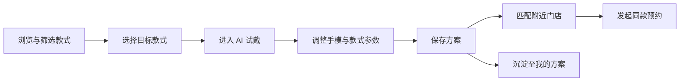

# PersoNail 产品需求文档

> 文档版本：V1.0  
> 产品形态：移动端 H5 Demo  
> 当前阶段：可交互原型 / 竞赛演示版  
> 更新日期：2026-06-07

## 1. 产品概述

### 1.1 产品定位

PersoNail 是一款面向美甲消费者与线下美甲门店的智能试戴与消费决策平台。产品通过款式内容、AI/3D 试戴、手模参数调整、方案保存和附近门店预约，帮助用户在到店前完成美甲款式决策，并帮助门店获得意向明确、需求清晰的顾客。

### 1.2 核心问题

用户在选择美甲款式时通常面临以下问题：

- 图片好看，但无法判断实际上手效果。
- 款式、肤色、甲型和甲长之间缺少个性化匹配依据。
- 用户与美甲师沟通成本高，容易出现效果偏差。
- 从浏览款式到寻找门店、预约服务的链路分散。

### 1.3 产品价值

**用户价值**

- 到店前预览款式效果，降低决策风险。
- 保存自己的手模与方案，减少重复沟通。
- 快速找到能够制作同款的附近门店。

**门店价值**

- 获得携带明确款式与参数的高意向用户。
- 提前了解用户需求，降低沟通和返工成本。
- 通过热门款式、AI 推荐和同款预约提高转化。

## 2. 产品目标

### 2.1 当前 Demo 目标

验证“款式浏览 → AI 试戴 → 保存方案 → 门店预约”的核心闭环是否清晰、可用、适合移动端展示。

### 2.2 核心指标

| 目标 | 核心指标 | 说明 |
| --- | --- | --- |
| 提升试戴参与度 | 试戴进入率 | 从款式页进入 AI 试戴的用户占比 |
| 提升款式决策效率 | 款式切换次数、方案保存率 | 衡量用户是否使用试戴完成决策 |
| 提升门店转化 | 门店点击率、预约发起率 | 衡量从线上方案到线下消费的转化 |
| 提升用户留存 | 已保存方案数、再次编辑率 | 衡量用户资产沉淀情况 |

## 3. 目标用户

### 3.1 核心用户

**美甲消费用户**

- 18 至 35 岁，习惯通过移动端浏览和收藏美甲款式。
- 在意款式是否显白、适合甲型、适合具体场景。
- 希望减少到店后的选择和沟通时间。

**美甲门店与美甲师**

- 希望获得更明确的用户需求。
- 希望通过线上内容与同款服务吸引附近用户。

### 3.2 典型使用场景

- 用户准备做美甲，希望快速筛选适合通勤或约会的款式。
- 用户看到喜欢的款式，但不确定是否适合自己的肤色与甲型。
- 用户完成试戴后，希望保存方案并预约附近能做同款的门店。
- 用户再次打开产品，希望查看和复用过去保存的方案。

## 4. 产品架构

### 4.1 当前信息架构

底部导航采用四个主入口：

| 页面 | 主要职责 |
| --- | --- |
| 款式 | 款式发现、搜索、标签筛选、进入试戴 |
| AI 试戴 | 查看手模、切换款式、调整参数、保存方案 |
| 门店 | 浏览附近门店、查看服务标签、发起预约 |
| 我的 | 查看用户信息和已保存方案 |

### 4.2 核心业务闭环

## 5. 核心用户流程

### 5.1 首次用户流程

1. 用户进入款式页，浏览热门款式。
2. 用户通过搜索或标签筛选目标款式。
3. 用户点击款式或“开始 AI 试戴”进入试戴页。
4. 系统展示默认手模及当前选中款式。
5. 用户调整甲片长度、肤色等参数。
6. 用户保存试戴方案。
7. 用户进入门店页，选择附近支持同款的门店并发起预约。

### 5.2 回访用户流程

1. 用户进入“我的”页面。
2. 查看已保存方案及适配度。
3. 复用或继续调整历史方案。
4. 根据历史方案预约门店。

## 6. 页面需求

### 6.1 款式页

#### 页面目标

帮助用户高效发现款式，并引导用户进入 AI 试戴。

#### 页面结构

- 顶部品牌标题与当前位置。
- 款式搜索框。
- AI 试戴引导卡片。
- 拍手、选款、试戴快捷入口。
- 横向标签筛选。
- 双列款式卡片列表。

#### 功能规则

| 功能 | 规则 |
| --- | --- |
| 搜索 | 根据款式名称和标签进行本地模糊筛选 |
| 标签筛选 | 点击后仅展示匹配标签的款式 |
| 款式卡片 | 展示图片、名称、价格、距离和标签 |
| 点击款式 | 设置为当前款式并进入 AI 试戴 |
| AI 试戴入口 | 直接进入试戴页，使用默认或最近款式 |

#### 当前实现状态

- 已实现搜索、标签筛选、款式卡片和试戴跳转。
- 当前款式及图片数据为 Mock 数据。

### 6.2 AI 试戴页

#### 页面目标

让用户预览款式效果、调整个人手模参数并保存方案。

#### 页面结构

- 已保存手模状态卡。
- 甲型识别与肤色区间。
- 实时手模参数调整。
- 最近试戴款式。
- 继续上次试戴提醒。
- 可试戴款式列表。
- 保存方案按钮。

#### 功能规则

| 功能 | 规则 |
| --- | --- |
| 切换款式 | 点击款式后更新当前选中款式 |
| 手模调参 | 当前支持甲片长度、肤色参数调整 |
| 保存方案 | 保存当前款式、手模参数快照、材质配置和贴纸信息 |
| 最近试戴 | 展示最近使用的款式，支持快速切换 |

#### 当前实现状态

- 已实现款式切换、手模参数调整和方案保存。
- 当前试戴效果为交互原型，尚未接入真实 3D 手部模型或图片生成服务。
- `Personail3DEngine` 已预留 Babylon.js 引擎接口，可用于后续真实 3D 渲染。

### 6.3 门店页

#### 页面目标

承接用户已确定的款式方案，完成线下服务转化。

#### 页面结构

- 页面标题与推荐说明。
- 距离、评分、名称排序入口。
- 支持 AI 试戴的门店分组。
- 门店图片、名称、评分、距离和服务标签。
- 立即预约按钮。

#### 功能规则

| 功能 | 规则 |
| --- | --- |
| 门店展示 | 默认按距离展示附近门店 |
| 服务标签 | 展示同款可做、猫眼专门、可约时间等信息 |
| 立即预约 | 发起预约并反馈申请已发送 |
| 同款匹配 | 正式版本应根据当前款式和 `availableStyleIds` 过滤门店 |

#### 当前实现状态

- 已实现门店列表和预约反馈。
- 排序入口当前仅展示视觉状态，尚未接入实际排序。
- 门店与预约数据当前为 Mock 数据。

### 6.4 我的页面

#### 页面目标

沉淀用户手模、方案与预约资产，支持后续复用。

#### 页面结构

- 用户信息卡。
- 已保存方案数量。
- 我的方案列表。
- 方案图片、名称、保存时间、适配度和预约状态。

#### 功能规则

| 功能 | 规则 |
| --- | --- |
| 方案展示 | 优先展示用户已保存方案；无方案时展示演示数据 |
| 方案信息 | 展示款式数、适配度和预约状态 |
| 后续扩展 | 支持方案详情、继续编辑、分享和再次预约 |

#### 当前实现状态

- 已实现本地会话内方案保存与列表展示。
- 尚未接入持久化存储、登录账号与方案详情页。

## 7. 功能需求优先级

### P0：核心闭环

- 款式浏览、搜索和标签筛选。
- 选择款式并进入试戴。
- 调整手模参数。
- 保存方案。
- 浏览门店并发起预约。
- 查看已保存方案。

### P1：体验增强

- 真实 3D 手模与美甲材质渲染。
- 款式详情页。
- 方案详情与继续编辑。
- 门店排序、筛选与同款匹配。
- 本地持久化或账号体系。
- 截图和分享。

### P2：智能运营

- 基于用户行为与手模参数的个性化推荐。
- AI 推荐理由。
- AI 专题与款式标签生成。
- 门店运营后台和款式上架。
- 推荐策略 A/B 测试。

## 8. 数据模型

### 8.1 用户手模参数 `HandParams`

| 字段 | 说明 |
| --- | --- |
| `fingerSlim` | 手指纤细度 |
| `fingerLength` | 手指长度 |
| `handWidth` | 手掌宽度 |
| `nailLength` | 甲片长度 |
| `skinTone` | 肤色参数 |

### 8.2 款式 `NailStyle`

| 字段 | 说明 |
| --- | --- |
| `id` | 款式唯一标识 |
| `title` | 款式名称 |
| `cover` | 封面或视觉配置 |
| `tags` | 款式标签 |
| `material_config` | 可驱动渲染的材质参数 |

### 8.3 方案 `Design`

方案包含用户手模参数快照、款式材质配置、贴纸信息和创建时间，可作为预约、分享和再次编辑的统一载体。

### 8.4 门店与预约

- 门店通过 `availableStyleIds` 声明可制作款式。
- 预约关联 `storeId`、`styleId`，可选关联 `designId`。
- 预约状态当前包括 `created` 与 `confirmed`。

## 9. 接口规划

### 9.1 当前业务 Mock API

| 接口 | 用途 |
| --- | --- |
| `GET /styles/hot` | 获取热门款式 |
| `GET /styles/:id` | 获取款式详情 |
| `POST /design/save` | 保存方案 |
| `GET /design/list` | 获取方案列表 |
| `GET /stores/nearby` | 获取附近门店 |
| `POST /booking/create` | 创建预约 |

### 9.2 AI Gateway

| 接口 | 用途 |
| --- | --- |
| `POST /ai/recommend` | 生成结构化推荐结果与理由 |
| `POST /ai/topic` | 生成运营专题 |
| `POST /ai/tag` | 生成白名单范围内的款式标签 |

### 9.3 AI 输出约束

- AI 能力统一通过 AI Gateway 调用。
- 输出必须为结构化 JSON。
- 推荐排序由可控规则或打分完成，LLM 仅生成理由与文案。
- AI 输出校验失败时使用 Mock、规则或缓存结果兜底。

## 10. 埋点与数据分析

### 10.1 当前埋点事件

| 事件 | 触发时机 |
| --- | --- |
| `enter_tryon` | 用户进入试戴 |
| `adjust_morph` | 用户调整手模参数 |
| `switch_style` | 用户切换款式 |
| `change_env` | 用户切换展示环境 |
| `save_design` | 用户保存方案 |
| `click_recommend_card` | 用户点击推荐款式 |
| `click_store` | 用户点击门店 |
| `create_booking` | 用户创建预约 |

### 10.2 建议新增事件

- `search_style`
- `filter_style`
- `view_style_card`
- `open_saved_design`
- `continue_edit_design`
- `booking_success`

## 11. 技术架构映射

| 产品模块 | 当前工程模块 |
| --- | --- |
| H5 页面与交互 | `apps/h5-main` |
| 前端全局状态 | Zustand `usePersonailStore` |
| 3D 引擎预留 | `Personail3DEngine` / Babylon.js |
| 业务 Mock API | `apps/mock-server` |
| AI 能力编排 | `apps/ai-gateway` |
| 共享数据模型 | `packages/types` |
| 行为埋点 | `packages/telemetry` |
| 模型与贴图资产 | `assets` |

## 12. 非功能需求

### 12.1 移动端体验

- 以 390px 移动端设计宽度为基准。
- 主要操作按钮高度不低于 44px。
- 页面底部为固定导航，内容区需预留安全距离。
- 横向标签与卡片区域支持触摸滑动。

### 12.2 性能

- 首屏优先加载页面结构和低质量预览资源。
- 图片和 3D 资产按需加载。
- 3D 正式接入后提供 WebGPU、WebGL 和静态预览降级。

### 12.3 稳定性与隐私

- 图片上传前提示用户用途与保存规则。
- AI 和预约接口需具备失败反馈和重试能力。
- 用户手部图片、手模参数和方案数据应支持删除。

## 13. 版本规划

### V1：当前交互 Demo

- 完成四个主页面和核心流程演示。
- 使用 Mock 数据完成方案保存与预约反馈。
- 验证视觉、交互和产品叙事。

### V1.5：真实数据闭环

- 页面接入 Mock Server。
- 方案本地持久化。
- 门店按当前款式匹配与实际排序。
- 补充款式详情、方案详情和预约结果页。

### V2：真实试戴与智能推荐

- 接入 Babylon.js 真实 3D 手模。
- 接入 Morph、材质和环境光参数。
- 接入 AI Gateway 推荐、专题和标签能力。
- 建立用户行为与推荐效果分析。

### V3：商业化与门店运营

- 上线门店账号与运营后台。
- 支持真实库存、价格、时段和订单。
- 支持门店投放、热门专题和转化分析。

## 14. Demo 验收标准

- 用户可从款式页选择任意款式并进入 AI 试戴。
- 用户可调整至少两项手模参数。
- 用户可保存当前方案，并在“我的”页面看到方案。
- 用户可查看附近门店并完成预约反馈。
- 四个主页面可通过底部导航稳定切换。
- 页面在移动端宽度下无明显溢出、错位和遮挡。
- 核心行为能够触发对应埋点。

## 15. 当前限制

- 当前试戴为可交互原型，尚未接入真实 3D 模型或 AI 图片生成。
- 页面暂未调用业务 Mock API，主要数据来自前端 Mock。
- 用户方案仅保存在当前运行会话中，刷新后会丢失。
- 当前无登录、支付、真实地理定位与真实预约能力。
- 图片资源来自外部演示地址，正式版本需要迁移至自有 CDN。
